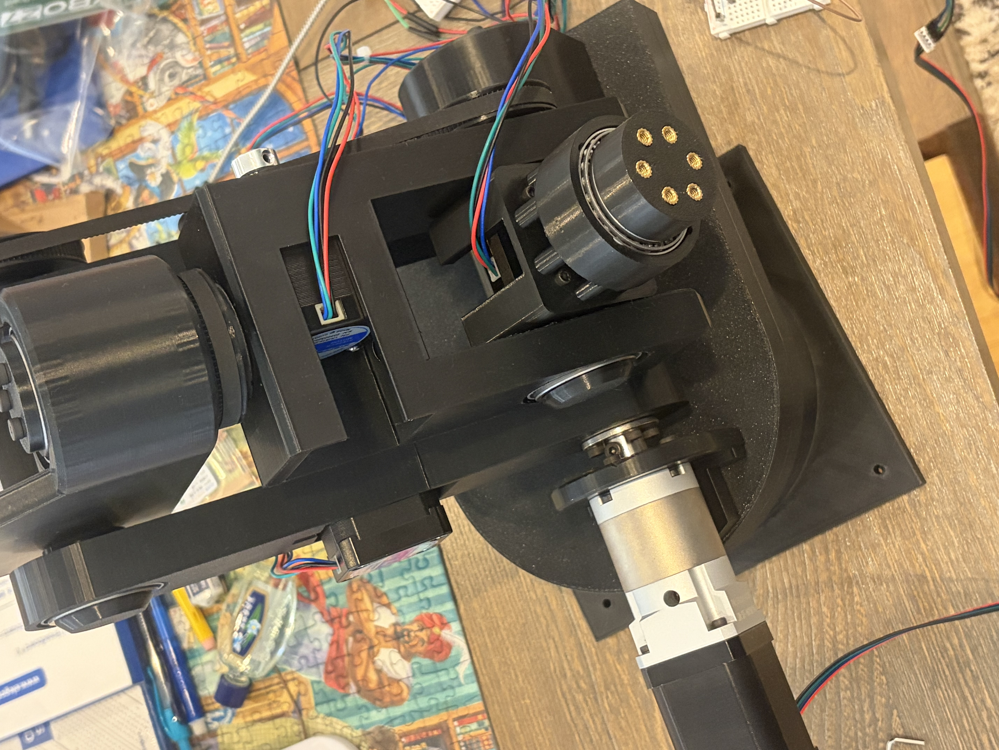

# 6-DOF Robotic Arm

A 6 degree-of-freedom robotic arm — mechanical design, custom CAN bus driver electronics, and ESP32 firmware.

<!-- Add a hero image or GIF here, see docs/ -->
<!--  -->

---

## Status

| Subsystem | State |
|---|---|
| Mechanical (STEP / STL) | ✅ Complete |
| PCB v1 (CAN + daisy-chained power) | ✅ Designed |
| PCB v2 (compact single-board) | 🚧 In progress |
| Firmware (ESP32) | 🚧 Joint test interface working |
| URDF / simulation | 📦 Separate repo — see below |
| Kinematics / motion planning | In progress |

---

## Demos

Short clips from prototyping. These are **modular, single-joint movements** recorded during bring-up.

| | |
|---|---|
| [Joint test 1](https://youtube.com/shorts/rJFGf9ptgZ8?feature=share) | [Joint test 2](https://youtube.com/shorts/dJXuIrIgwTA?feature=share) |
| [Joint test 3](https://youtube.com/shorts/uOOgzPDuszk?feature=share) | [Joint test 4](https://youtube.com/shorts/0TmPJE_S-cc?feature=share) |
| [Joint test 5](https://youtube.com/shorts/0FotfFd8Ojw?feature=share) | [Joint test 6](https://youtube.com/shorts/54SWqDdd2mk?feature=share) |

---

## Mechanical

Full CAD is complete and released.

- **STL** file for the entire arm.
- BOM

*TODO: print settings, material*

---

## Electrical

### PCB v1 — distributed driver boards
One driver board per joint, linked over a **CAN bus** with **daisy-chained power**, so each joint only needs a single connection to its neighbor rather than a run back to a central controller. This keeps the harness inside the arm minimal.

Designed in KiCad.

### PCB v2 — compact single board
A second revision is in progress that consolidates the design onto one more compact board.

<!--  -->

*TODO: schematic PDF, connector pinout, power requirements, motor/driver part numbers.*

---

## Firmware

ESP32 firmware for **bench-testing individual joints through a web interface**. The board hosts a page that exposes per-joint controls, so joints can be jogged and characterized without writing host-side code.

This is test/bring-up firmware — not a motion controller.

*TODO: flashing instructions, pin mapping, network setup, toolchain.*

---

## URDF

The robot description lives in a separate repository:

**[6DOF-URDF](https://github.com/wang-eric-c/6DOF-URDF)**

---

## Roadmap

- [ ] Finish PCB v2 (compact single-board)
- [ ] Closed-loop joint control over CAN
- [ ] Populate URDF repo with meshes and joint limits
- [ ] Forward/inverse kinematics
- [ ] Coordinated multi-axis motion

---
